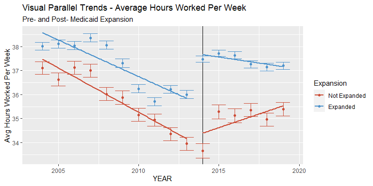
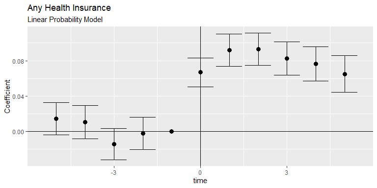

Medicaid Expansion Effects on Labor
================
Colin Wick
4/21/2021

### Background & Intro

The average health insurance premium cost for a single individual rose
from $3,000 to $7,000 from 1999 to 2018. Over the same period, family
coverage increased from $6000 to $20,000 per year \[Health Affairs
(2018)\] (healthaffairs.org/doi/10.1377/hlthaff.2018.1001) . In 2010,
the Affordable Care Act included provisions for expansion of Medicaid
for low-income individuals up to 138% of the federal poverty line.
Though not a perfect program, qualifying for medicaid, in a sense,
represents a transfer of value to an individual or family, respectively,
at no cost.

After clearing the initial Supreme Court challenges, 27 states expanded
Medicaid on the first year of the program’s availability with another 10
expanding over the following 7 years. 4 states are currently in the
process of implementing their expansions.

Given the stark cutoff of eligibility and relatively large income
transfer that the program represents, bunching around the eligibility
cutoff would be expected. This would be consistent with Saez (2010).
However, in Miller (2019) they find little evidence of the kind of
bunching present around the EITC trapezoid vertices. However, access to
Medicaid is very different in terms of both public awareness and access.
Even without bunching around the cutoff, there may still be some
influence on labor decisions (or reporting) based on expanding
eligibility.

I confirm this analysis by post-hoc constructing medicaid eligibility
using reported income and family size (based on marriage and number of
children) and computing the difference by state-year FPL cutoffs going
back to 2004. From here, all family incomes can be normalized around a 0
point (exactly eligible for Medicaid). Analysis from the Kaiser Family
foundation found that removal of the asset test only resulted in a 3%
increase in uptake.

#### Definition of Population of Interest

This study specifically analyzes the population of families within
$10,000 of medicaid coverage in either direction. This is the rough
estimate of the “medicaid gap” which conceptually developed alongside
the ACA’s implementation but existed before as well. Though a relatively
arbitrary cutoff, the $10,000 cutoff is made where those at the high end
would qualify for ACA Silver Plan Benchmarks and Medicaid coverage would
not be worth reducing income. Similarly, for the low end, $10,000
represents adding 2 full 8-hour days of work at $12/hr. This cutoff
represents utting down all Americans to a reasonable population
represents those who are certainly affected by Medicaid’s income cutoff
out to the edges of that income-qualification decision.

The population of interest is workers age 26-60. This population
represents those most closely on the margin of the Medicaid cutoff. By
the same logic other studies cut off health outcomes at the
near-Medicare cohort, this study rather focuses on those for whom
exogenous health effects may play less of a role in labor decisions. The
lower bound of 26 is chosen due to the ACA’s rule allowing children to
stay on parent’s health insurance policy until 26, which would distort
estimates. I further limit the data to those who worked within the past
year and did not report disability income to focus on marginal hours and
wages rather than entering the labor force.

The above three charts visually represent a break in parallel trends for
the variables of interest. The clearest break is in reported
hours-per-week, which just visually shows a dramatic \~2hr increase
relative to “parallel trend” in this sample. This represents a 5-10%
increase in hours per week.

The other two key measurements show a less dramatic visual difference.
Hourly wage is far less marginally adjustable by workers, so the
relatively stable trend between expansion and non-expansion states is
expected. Wage income is reported as a separate variable but could also
be constructed using CPS data.

For the purposes of this study, reported wage income is used, since it
reduces respondent bias. Multiplying reported hours per week, weeks
worked, and hourly wage would each be subject to a whole number bias
respectively, while wage income is only subject once.

The next step is to statistically define these parallel trends using an
event-study methodology to ensure there are measurable differences in
the treated population over this time period for our variable of
interest (Medicaid eligibility).

## Methodology & Establishing Causal Baseline

The intention of the study is to focus on a more narrow question. For
those near the Medicaid eligibility cutoff, did the “shock” of the ACA
cause those around the cutoff to increase their economic output, as
measured by weekly hours and total income from wages.

The study design is based, in part, off of Miller (2019) which similarly
uses non-linked CPS data with an eligibility construction. Under a
non-linked circumstance, the only means for analysis are in aggregate
and by-cohort. The first step in building the difference-in-differences
estimator is to establish parallel trends across the states, both in
insurance rates and in labor output. By construction, this estimator is
showing the probability (or level) for untreated

This one is interesting, because we find an increase in private health
insurance uptake. This is partially explained by the ACA subsidies which
brought down the cost of private insurance for households and the upper
side of this population’s income distribution may qualify depending on
the number of children in their family and state-level health insurance
arrangement.

For the population of interest, we find that treatment had a dramatic
effect on insurance rate. This is consistent with Miller 2019, both
reaffirming the eligibility construction and showing that there are
detectable state-level effects on insurance rates. The same calculation
was done across the three analytic variables to the same effect
(appended to the bottom of this study as Figures 1-3).

The first step in this analysis established that there may be a
detectable treatment effect over time, but it is also necessary to
establish this across the medicaid income threshold before and after
treatment. The effects of increasing the medicaid threshold affect those
above and below differently, so those just above may reduce hours while
those below may increase hours when the Medicaid cutoff becomes a
relevant choice in labor decisions. The next step in shaving off other
potential causal factors is differences by demographics across the
relevant threshold. Similar to the work in Hansen (2015) which shows
that there is not a relevant discontinuity across the BAC threshold.

#### Placebo & Weighting

The process of post-constructing medicaid eligibility also yields a
simple placebo mechanism by which the outcomes of a difference in
differences can be measured. The standard conception of the medicaid gap
is $10,000, meaning those outside of that threshold on either side will
not face the same kind of imminent consideration on labor decisions, but
will still have similar demographics and constraints as those just over
the $10,000 threshold.

Similarly, those closest to the Medicaid threshold could stand to gain
the most from qualifying (or disqualifying) for Medicaid, which
motivates the use of RDD-style triangular or quadratic weighting
mechanism for those closest to that threshold to upweight the marginal
decisions of those who are closest. This intuitively makes sense, since
someone who merely needs to work one-fewer shifts per month, or
one-fewer hours per week may opt to do so when that would qualify them
for medicaid. Similarly, those who might have been bunching just-below
the threshold have flexibility to work the corresponding marginal hour.
On the contrary, few people (especially those for whom Medicaid is
relevant) will not be able to simply “make” $5000 more dollars based on
marginal labor decisions.

## Model Specification

The first model employed is a standard difference-in-difference model to
establish a relationship with respect to expansion. In this sample, only
looking at states which expanded immediately after the law went into
effect. Where each individual (*i*) in state (*s*) is treated at time
(*t*) with controls for each state and year effects, as well as a vector
of demographic control variables *μ*. For this regression, using the
formula:

*H**i*, *s*, *t* = *α* + *γ* ⋅ *T**r**e**a**t* + *β* ⋅ *P**o**s**t* + *δ* ⋅ *T**r**e**a**t* ⋅ *P**o**s**t* + *μ**i* + *ϵ*

Second model employs the strategy highlighted in Black (2019) and Miller
(2019), which accounts for lingering effects of treatment, setting “D”
as a dummy representing ever receiving treatment and R representing a
dummy for each relative event time. Using the formula:

*H**i*, *t*, *s* = *α* + *γ* \* (*D* = 1) + *δ*(*R**t*, *s* = 1) + *β**s* + *β**t* + *μ**i* + *ϵ**i*, *s*, *t*

To estimate whether these effects are most prevalent on the margin, I
employ a weighted regression model using both a triangular and quadratic
scheme following the following formulas. A triangular scheme will
greatly weight the effects for those closest to the relevant margin,
while the quadratic model will maintain the weights for those slightly
further away from the threshold.

$$W\_{tri} = 1-\\frac{abs(x)-10000}{10000} \* W\_{ASEC}$$

$$W\_q = 1-\\frac{x^2}{10000^2} \* W\_{ASEC}$$

The weighting scheme equals 1 for those directly on the threshold, and
eventually equals 0 for those furthest. This method is commonly employed
in a regression discontinuity design, but is relevant in this case for
isolating *whether* this effect is happening on the margin or across the
entire workforce. By isolating this marginal movement as statistically
distinct from the entire near-medicaid workforce, there is a stronger
case to be made that the threshold itself is the cause of the behavior,
not secular trends among all low-income individuals.

Finally, these models look at aggregate effects across the entire
near-Medicaid workforce, including those above but near the threshold.
This presents two key problems with causal inference. The near-medicaid
population is, by definition, living near-poverty, meaning other
state-level or macroeconomic changes may affect labor outcomes. Merely
running the same regression on those strictly below the Medicaid
threshold will increase the intensity of this selection effect.

Secondly, this data is not linked and the incomes measured in the data
are within a tight band. Though incomes are relatively sticky, workers
could easily have moved across or within the $10,000 threshold region
over the time period studied. To account for this, testing against
incomes well-above the threshold will work against this effect, though
not perfectly.

To account for this, I employ a simple placebo testing framework.
Setting a dummy variable equal to 1 if the observation is in the “above”
threshold. With each observation taking a value of 1 or 0 for B =
Placebo, P = Post, and T = Treat.

*H**i*, *s*, *t* = *α* + *θ*1 ⋅ *B* + *θ*2 ⋅ *T* + *θ*3 ⋅ *P* + *θ*4 ⋅ *B* ⋅ *T* + *θ*5 ⋅ *B* ⋅ *P* + *θ*6 ⋅ *T* ⋅ *P* + *θ*7 ⋅ *B* ⋅ *T* ⋅ *P* + *μ**i* + *ϵ*

*θ*7 is the triple-difference parameter of interest, which
isolates the effect for low-income individuals against the effect for
those sufficiently above the medicaid threshold. I also run this same
model for those just above the medicaid threshold against those
well-below to estimate whether those above adjusted income down to
qualify for medicaid.

## Results

#### Placebo Regressions

    ## 
    ## Difference-in-Differences Results
    ## ======================================================================================
    ##                                         Dependent variable:                           
    ##               ------------------------------------------------------------------------
    ##                                             Weekly Hours                              
    ##                   Basic DiD        Event Study    Triangular Weights Quadratic Weights
    ##                      (1)               (2)               (3)                (4)       
    ## --------------------------------------------------------------------------------------
    ## DiD Estimator 2.454*** (0.169)                                                        
    ## Year 0                          2.978*** (0.202)   3.346*** (0.204)  3.189*** (0.203) 
    ## Year 1                          2.873*** (0.262)   3.055*** (0.265)  2.984*** (0.264) 
    ## Year 2                          2.979*** (0.265)   2.993*** (0.268)  2.921*** (0.267) 
    ## Year 3                          2.381*** (0.283)   2.719*** (0.288)  2.601*** (0.287) 
    ## Year 4                          2.478*** (0.293)   3.116*** (0.301)  2.978*** (0.299) 
    ## Year 5                          2.073*** (0.334)   2.251*** (0.339)  2.238*** (0.339) 
    ## Intercept     36.528*** (0.460) 36.539*** (0.459) 35.932*** (0.476)  36.120*** (0.474)
    ## --------------------------------------------------------------------------------------
    ## Observations       96,543            96,543             96,543            96,543      
    ## ======================================================================================
    ## Note:                                                      *p<0.1; **p<0.05; ***p<0.01

NOTE EFFECT IS LARGER AS WE MOVE CLOSER TO THE MARGIN WHICH VALIDATES A
PLACEBO ANALYSIS

    ## 
    ## Triple Difference Results
    ## =========================================================================
    ##                                      Dependent variable:                 
    ##                     -----------------------------------------------------
    ##                                          UHRSWORKLY                      
    ##                             Just Below                 Just Above        
    ##                                (1)                        (2)            
    ## -------------------------------------------------------------------------
    ## Constant                40.848*** (0.446)          34.917*** (1.058)     
    ## Treatment                 -0.458 (0.653)             1.033 (1.299)       
    ## Post                    -2.805*** (0.323)          -10.841*** (1.208)    
    ## Treated                 -4.607*** (0.244)           1.678** (0.660)      
    ## Treatment * Post         1.151*** (0.211)           6.852*** (1.169)     
    ## Treatment * Treated      1.722*** (0.279)           1.393** (0.701)      
    ## Post * Treated          -1.919*** (0.397)           5.900*** (1.167)     
    ## Triple Difference        2.007*** (0.442)          -4.118*** (1.209)     
    ## -------------------------------------------------------------------------
    ## Observations                  61,517                     34,045          
    ## R2                            0.096                      0.106           
    ## Adjusted R2                   0.095                      0.104           
    ## Residual Std. Error    388.132 (df = 61434)       421.758 (df = 33962)   
    ## F Statistic         79.990*** (df = 82; 61434) 48.942*** (df = 82; 33962)
    ## =========================================================================
    ## Note:                                         *p<0.1; **p<0.05; ***p<0.01

NEEDS

1.  Establish theoretical relationship between eligibility and hours
    worked, wages, etc. Marginal hours of work, gap.

2.  Causal baseline, parallel trends

3.  Basic difference in difference estimator

4.  Break out by cohorts

5.  Placebo test against those with incomes higher. Split on qual &gt; 0
    (assuming people won’t drop down to qualify)

NEED (other errata notes for myself)

1.  Motivate narrowing the dataset within $10000 of the mcaid cutoff

2.  Analysis around the running variable for an RDD design?

3.  For those to the left of the gap, did state-wide hours or income
    increase with mcaid expansion

4.  To those to the right of the gap, did hrs/wages decrease with mcaid
    expansion
