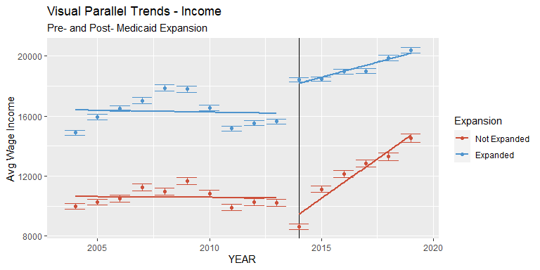

Medicaid Expansion Effects on Labor
================
Colin Wick
4/21/2021

### Background & Intro

The average health insurance premium cost for a single individual rose
from $3,000 to $7,000 from 1999 to 2018. Over the same period, family
coverage increased from $6000 to $20,000 per year \[Health Affairs
(2018)\] (healthaffairs.org/doi/10.1377/hlthaff.2018.1001) . In 2010,
the Affordable Care Act included provisions for expansion of Medicaid
for low-income individuals up to 138% of the federal poverty line.
Though not a perfect program, qualifying for medicaid, in a sense,
represents a transfer of value to an individual or family, respectively,
at no cost.

After clearing the initial Supreme Court challenges, 27 states expanded
Medicaid on the first year of the program’s availability with another 10
expanding over the following 7 years. 4 states are currently in the
process of implementing their expansions.

Given the stark cutoff of eligibility and relatively large income
transfer that the program represents, bunching around the eligibility
cutoff would be expected. This would be consistent with Saez (2010).
However, in Miller (2019) they find little evidence of the kind of
bunching present around the EITC trapezoid vertices.

I confirm this analysis by post-hoc constructing medicaid eligibility
using reported income and family size (based on marriage and number of
children) and computing the difference by state-year FPL cutoffs going
back to 2004. From here, all family incomes can be normalized around a 0
point (exactly eligible for Medicaid). Analysis from the Kaiser Family
foundation found that removal of the asset test only resulted in a 3%
increase in uptake.

### Definition of Population of Interest

This study specifically analyzes the population of families within
$10,000 of medicaid coverage in either direction. This is the rough
estimate of the “medicaid gap” which conceptually developed alongside
the ACA’s implementation but existed before as well.

The population of interest is workers age 26-64. This population
represents those most closely on the margin of the Medicaid cutoff. By
the same logic other studies cut off health outcomes at the
near-Medicare cohort, this study rather focuses on those for whom
exogenous health effects may play less of a role in labor decisions. The
lower bound of 26 is chosen due to the ACA’s rule allowing children to
stay on parent’s health insurance policy until 26, which would distort
estimates. I further limit the data to those who worked within the past
year to focus on marginal hours and wages rather than entering the labor
force.

The above three charts visually represent a break in parallel trends for
the variables of interest. The clearest break is in reported
hours-per-week, which just visually shows a dramatic \~2hr increase
relative to “parallel trend” in this sample. This represents a 5-10%
increase in hours per week.

The other two key measurements show a less dramatic visual difference.
Hourly wage is far less marginally adjustable by workers, so the
relatively stable trend between expansion and non-expansion states is
expected. Wage income is reported as a separate variable but could also
be constructed using CPS data.

For the purposes of this study, reported wage income is used, since it
reduces respondent bias. Multiplying reported hours per week, weeks
worked, and hourly wage would each be subject to a whole number bias
respectively, while wage income is only subject once.

The next step is to statistically define these parallel trends using an
event-study methodology to ensure there are measurable differences in
the treated population over this time period for our variable of
interest (Medicaid eligibility).

### Methodology & Establishing Causal Baseline

The intention of the study is to focus on a more narrow question. For
those near the Medicaid eligibility cutoff, did the “shock” of the ACA
cause those around the cutoff to increase their economic output, as
measured by hours and wages.

The study design is based, in part, off of Miller (2019) which similarly
uses non-linked CPS data with an eligibility construction. Under a
non-linked circumstance, the only means for analysis are in aggregate
and by-cohort.

This one is interesting, because we find an increase in private health
insurance uptake. This is partially explained by the ACA subsidies which
brought down the cost of private insurance for households and the upper
side of this population’s income distribution may qualify depending on
the number of children in their family and state-level health insurance
arrangement.

For the population of interest, we find that treatment had a dramatic
effect on insurance rate. This is consistent with Miller 2019, both
reaffirming the eligibility construction and giving a basis to move
forward with analysis.

NEEDS

1.  Establish theoretical relationship between eligibility and hours
    worked, wages, etc. Marginal hours of work, gap.

2.  Causal baseline, parallel trends

3.  Basic difference in difference estimator

4.  Break out by cohorts

5.  Placebo test against those with incomes higher. Split on qual &gt; 0
    (assuming people won’t drop down to qualify)

NEED (other errata notes for myself)

1.  Motivate narrowing the dataset within $10000 of the mcaid cutoff

2.  Analysis around the running variable for an RDD design?

3.  For those to the left of the gap, did state-wide hours or income
    increase with mcaid expansion

4.  To those to the right of the gap, did hrs/wages decrease with mcaid
    expansion
